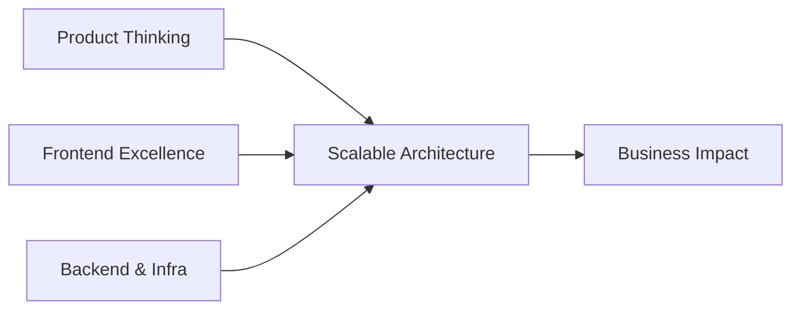
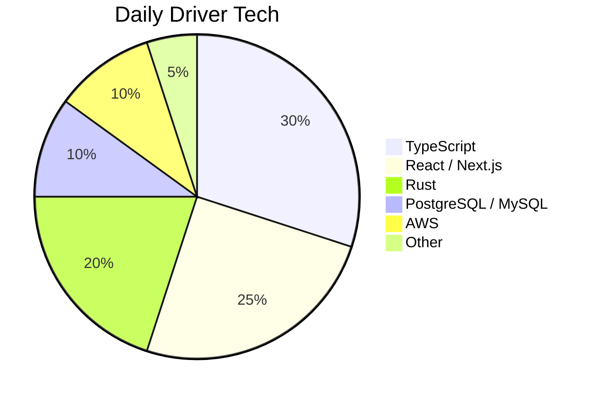
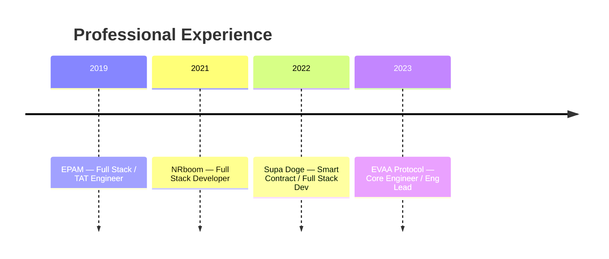

# 👋 Hi, I'm Viachaslau Rouski

Full Stack Software Engineer with **6+ years of experience** building scalable, high-performance products across Web2 and Web3. I focus on **engineering quality, system design, and shipping fast without breaking things**.

📍 Lisbon, Portugal
💻 Full Stack · Infrastructure-minded 

---

## 🧠 Engineering Profile

I operate at the intersection of **product, engineering, and infrastructure**, often owning projects end-to-end — from idea and architecture to delivery and optimization.

---

## 🛠️ Tech Stack

### Core

**Languages & Frameworks**
Rust, TypeScript, React, Next.js, Node.js, GraphQL

**Backend & Infra**
PostgreSQL, MySQL, Docker, AWS, CI/CD, Grafana

**Web3**
Solidity, TON, NEAR, Ethereum

**Testing & Quality**
Cypress, Selenium, Gherkin

---

## 📈 Career Timeline

---

## 🔗 Links

* 💼 [LinkedIn](https://www.linkedin.com/in/viachaslau-rouski-58840521a/)
* 🌐 [Portfolio](https://vrovsky-portfolio.netlify.app/)
* 📬 [vrovsky@gmail.com](mailto:vrovsky@gmail.com)

---

> *I enjoy complex systems, high-load problems, and products that actually ship.*
